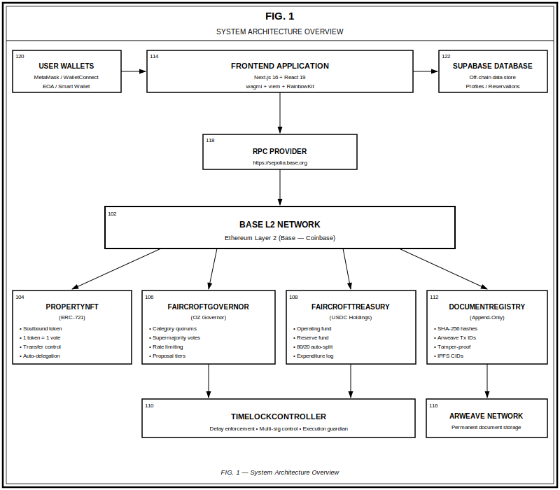
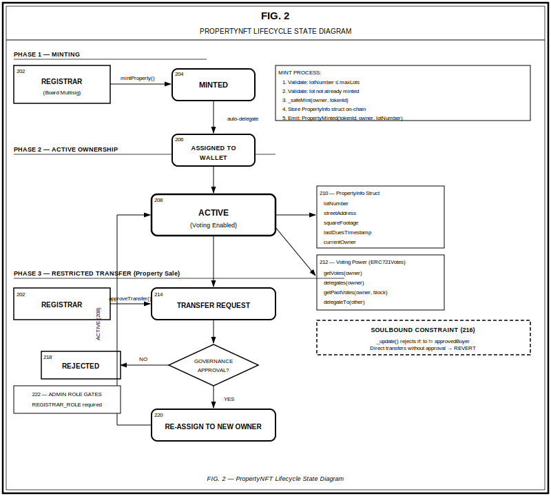
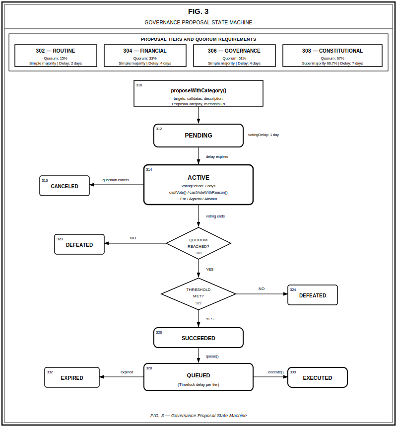
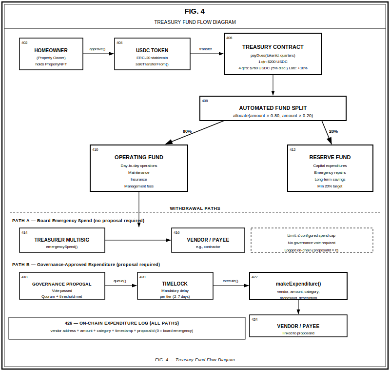
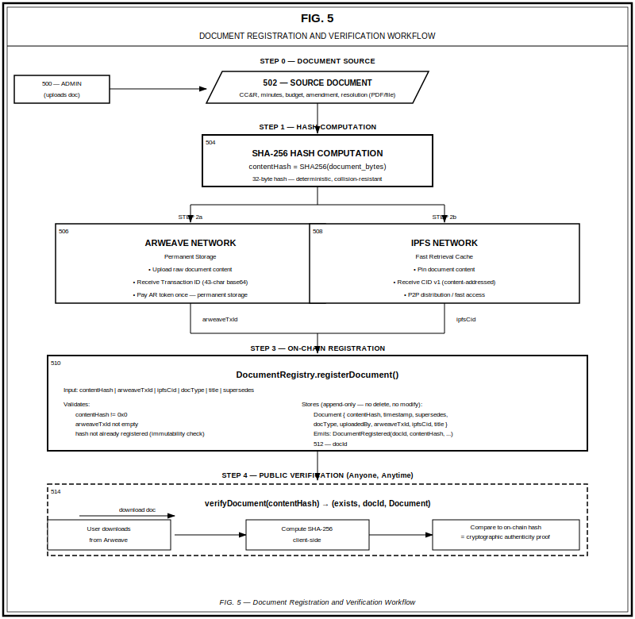
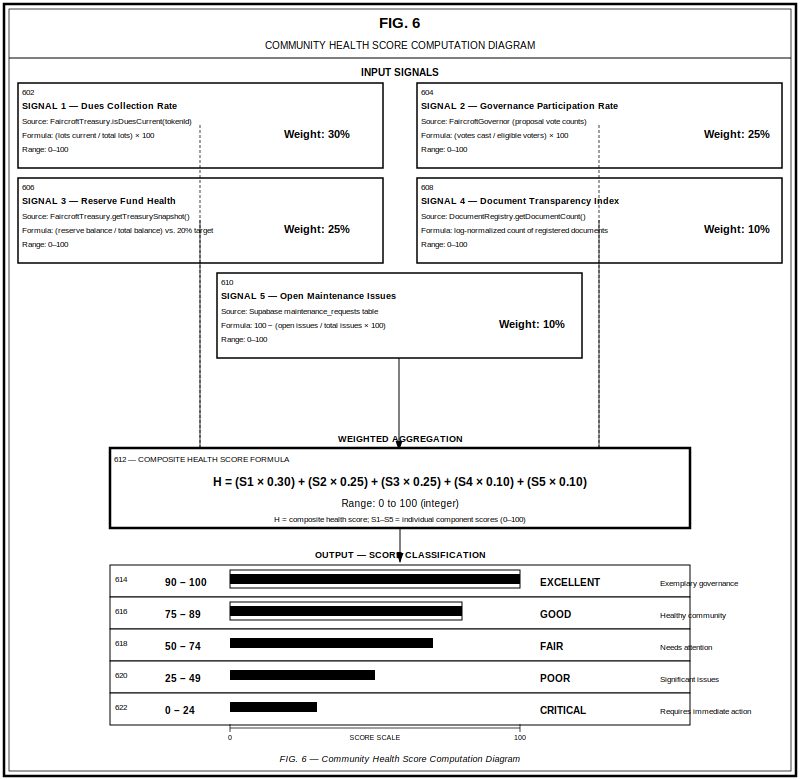
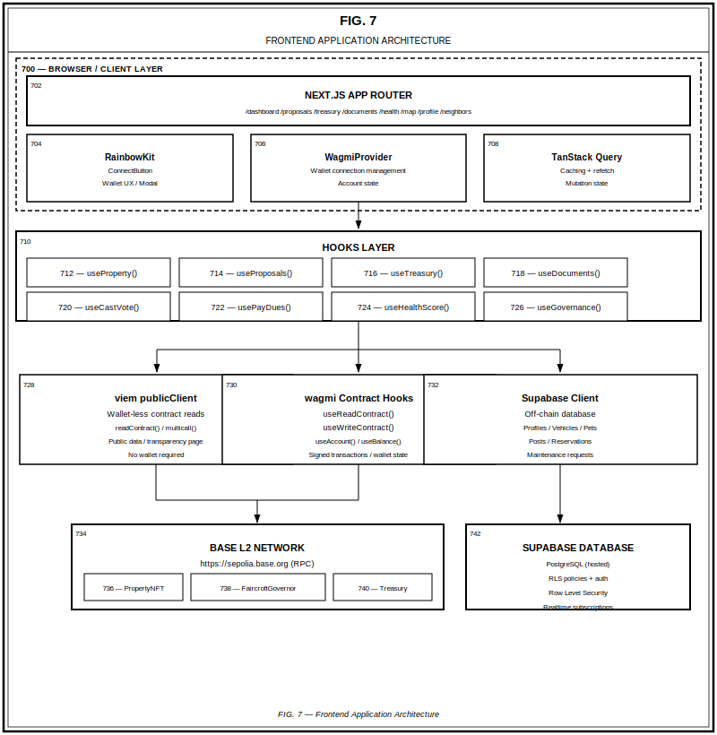

# SuvrenHOA Patent Drawings

**Inventor:** Ryan Shanahan | **Assignee:** Suvren LLC  
**Application:** Blockchain-Based Homeowners Association Governance System  
**Date Prepared:** April 2026

---

> This document contains all 7 USPTO-compliant patent drawings for the SuvrenHOA provisional patent application. Drawings conform to 37 CFR 1.84 requirements: black-and-white line art, reference numerals, figure titles, and legends.

---

## FIG. 1 — System Architecture Overview

### Reference Numeral Legend — FIG. 1

| Numeral | Element |
|---------|---------|
| 102 | Base L2 Network — Ethereum Layer 2 (Base — Coinbase) |
| 104 | PropertyNFT Contract — ERC-721 soulbound token, 1 token = 1 vote |
| 106 | FaircroftGovernor Contract — On-chain governance with proposal categories |
| 108 | FaircroftTreasury Contract — USDC holdings, operating and reserve funds |
| 110 | TimelockController — Delay enforcement, multi-sig control, execution guardian |
| 112 | DocumentRegistry Contract — Append-only SHA-256 document hash registry |
| 114 | Frontend Application — Next.js 16 + React 19, wagmi + viem + RainbowKit |
| 116 | Arweave Network — Permanent document storage |
| 118 | RPC Provider — https://sepolia.base.org |
| 120 | User Wallets — MetaMask / WalletConnect, EOA / Smart Wallet |
| 122 | Supabase Database — Off-chain data store, profiles and reservations |

**Description:** FIG. 1 illustrates the complete system architecture of the blockchain-based HOA governance platform. The system comprises a multi-layer stack: (1) a user layer including homeowner wallets and a Next.js frontend application; (2) an RPC provider bridging the frontend to the blockchain; (3) the Base L2 network as the execution layer; (4) four primary smart contracts (PropertyNFT, FaircroftGovernor, FaircroftTreasury, DocumentRegistry) deployed on the L2 network; and (5) supporting infrastructure including the TimelockController for governance delay enforcement and the Arweave network for permanent document storage. An off-chain Supabase database stores non-sensitive community data such as resident profiles and facility reservations.

---

## FIG. 2 — PropertyNFT Lifecycle State Diagram

### Reference Numeral Legend — FIG. 2

| Numeral | Element |
|---------|---------|
| 202 | Registrar (Board Multisig) — Authorized entity with REGISTRAR_ROLE |
| 204 | MINTED State — Token successfully created and assigned to initial owner |
| 206 | ASSIGNED TO WALLET State — Property NFT linked to homeowner wallet address |
| 208 | ACTIVE State — Token in normal ownership with voting power enabled |
| 210 | PropertyInfo Struct — On-chain storage: lotNumber, streetAddress, squareFootage, lastDuesTimestamp |
| 212 | Voting Power (ERC721Votes) — getVotes(), delegates(), getPastVotes(), delegateTo() functions |
| 214 | TRANSFER REQUEST State — Board-initiated transfer approval pending |
| 216 | Governance Approval Decision — Diamond: transfer approved or rejected |
| 218 | REJECTED State — Transfer denied; property remains with current owner |
| 220 | RE-ASSIGN TO NEW OWNER State — Token transferred to verified buyer wallet |
| 222 | Admin Role Gates — REGISTRAR_ROLE required for all state transitions |

**Description:** FIG. 2 depicts the complete lifecycle of a PropertyNFT token from initial minting through active ownership and restricted transfer. The diagram illustrates the soulbound constraint mechanism: the `_update()` internal function enforces that token transfers are only permitted when the receiving address matches a board-approved buyer recorded in the `pendingTransfers` mapping. Upon minting, the contract automatically delegates voting power to the token holder, enabling immediate governance participation without a separate delegation transaction. The lifecycle shows three phases: (1) minting by the board registrar, (2) active ownership with voting power, and (3) the board-gated transfer process for property sales.

---

## FIG. 3 — Governance Proposal State Machine

### Reference Numeral Legend — FIG. 3

| Numeral | Element |
|---------|---------|
| 302 | ROUTINE Proposal Tier — 15% quorum, simple majority, 2-day timelock delay |
| 304 | FINANCIAL Proposal Tier — 33% quorum, simple majority, 4-day timelock delay |
| 306 | GOVERNANCE Proposal Tier — 51% quorum, simple majority, 4-day timelock delay |
| 308 | CONSTITUTIONAL Proposal Tier — 67% quorum, 66.7% supermajority, 7-day timelock delay |
| 310 | proposeWithCategory() Entry Point — Proposal submission with targets, calldatas, category, metadataUri |
| 312 | PENDING State — Proposal created; 1-day voting delay period |
| 314 | ACTIVE State — 7-day voting window; castVote() / castVoteWithReason() |
| 316 | CANCELED State — Guardian (board) canceled before or during voting |
| 318 | QUORUM REACHED Decision — Check: total votes ≥ category quorum requirement |
| 320 | DEFEATED State (quorum failure) — Insufficient participation |
| 322 | THRESHOLD MET Decision — Check: for-votes > category threshold percentage |
| 324 | DEFEATED State (threshold failure) — Votes cast but majority not met |
| 326 | SUCCEEDED State — Both quorum and threshold requirements satisfied |
| 328 | QUEUED State — Proposal queued in TimelockController with tier-specific delay |
| 330 | EXECUTED State — Timelock delay elapsed; on-chain actions executed |
| 332 | EXPIRED State — Queued proposal not executed within expiration window |

**Description:** FIG. 3 illustrates the complete state machine for governance proposals in the FaircroftGovernor contract. The novel aspect of this system is the tiered quorum and threshold mechanism: rather than a single global quorum percentage, each proposal is assigned one of four categories at creation time, and the quorum and pass-threshold requirements vary per category. Constitutional amendments require 67% quorum and a two-thirds supermajority to pass, providing strong protection for foundational community rules. The state machine shows all possible paths from proposal creation through execution or expiration, including the guardian cancellation path and the two distinct defeat conditions (quorum failure vs. threshold failure).

---

## FIG. 4 — Treasury Fund Flow Diagram

### Reference Numeral Legend — FIG. 4

| Numeral | Element |
|---------|---------|
| 402 | Homeowner — Property owner making dues payment, holds PropertyNFT |
| 404 | USDC Token — ERC-20 stablecoin; safeTransferFrom() used for payment |
| 406 | Treasury Contract — Central fund custodian; payDues(tokenId, quarters) |
| 408 | Automated Fund Split — Allocates: 80% to Operating, 20% to Reserve |
| 410 | Operating Fund — Day-to-day operations: maintenance, insurance, management fees |
| 412 | Reserve Fund — Capital expenditures, emergency repairs, long-term savings (min 20% target) |
| 414 | Treasurer Multisig — TREASURER_ROLE; emergencySpend() up to configured cap |
| 416 | Vendor / Payee (Path A) — Recipient of board emergency spending |
| 418 | Governance Proposal — Vote passed; quorum and threshold met |
| 420 | Timelock — Mandatory delay per proposal tier (2–7 days) |
| 422 | makeExpenditure() — GOVERNOR_ROLE function: vendor, amount, category, proposalId |
| 424 | Vendor / Payee (Path B) — Recipient of governance-approved expenditure |
| 426 | On-Chain Expenditure Log — All transactions: vendor + amount + category + timestamp + proposalId |

**Description:** FIG. 4 illustrates the complete fund flow through the FaircroftTreasury contract. Dues payments from homeowners are received in USDC and automatically split 80/20 between operating and reserve funds. The diagram shows two distinct withdrawal paths: Path A permits the board treasurer to make emergency expenditures up to a configured per-period limit without a governance vote (suitable for urgent maintenance); Path B requires a passed governance proposal to queue through the TimelockController before funds can be disbursed. All expenditures are permanently recorded on-chain with metadata including the vendor address, amount, category, timestamp, and linked proposal ID.

---

## FIG. 5 — Document Registration and Verification Workflow

### Reference Numeral Legend — FIG. 5

| Numeral | Element |
|---------|---------|
| 500 | Admin — Board member or authorized uploader with RECORDER_ROLE |
| 502 | Source Document — Original document: CC&R, minutes, budget, amendment (PDF/file) |
| 504 | SHA-256 Hash Computation — contentHash = SHA256(document_bytes); 32-byte deterministic hash |
| 506 | Arweave Network — Permanent storage; upload returns 43-character Transaction ID |
| 508 | IPFS Network — Fast retrieval cache; pin returns CID v1 content-addressed hash |
| 510 | DocumentRegistry.registerDocument() — On-chain registration: contentHash, arweaveTxId, ipfsCid, docType, title, supersedes |
| 512 | docId — Assigned sequential document identifier (array index) |
| 514 | verifyDocument(contentHash) — Public verification: returns (exists, docId, Document) |

**Description:** FIG. 5 depicts the four-step document registration and verification workflow. Step 0: an authorized administrator selects a source document. Step 1: the SHA-256 hash of the raw document bytes is computed. Step 2a: the document is uploaded to Arweave for permanent storage, returning a transaction ID; Step 2b: the document is pinned to IPFS for fast retrieval, returning a CID. Step 3: the `registerDocument()` function on the DocumentRegistry contract records the content hash, Arweave transaction ID, IPFS CID, document type, title, and supersession pointer on-chain. The registry is append-only — no deletions or modifications are possible. Step 4: any party can verify document authenticity by downloading the file from Arweave, computing its SHA-256 hash, and comparing the result against the on-chain record via `verifyDocument()`.

---

## FIG. 6 — Community Health Score Computation Diagram

### Reference Numeral Legend — FIG. 6

| Numeral | Element |
|---------|---------|
| 602 | Signal 1 — Dues Collection Rate: (lots current / total lots) × 100; Weight: 30%; Source: FaircroftTreasury.isDuesCurrent() |
| 604 | Signal 2 — Governance Participation Rate: (votes cast / eligible voters) × 100; Weight: 25%; Source: FaircroftGovernor vote counts |
| 606 | Signal 3 — Reserve Fund Health: (reserve balance / total balance) vs. 20% target; Weight: 25%; Source: FaircroftTreasury.getTreasurySnapshot() |
| 608 | Signal 4 — Document Transparency Index: log-normalized registered document count; Weight: 10%; Source: DocumentRegistry.getDocumentCount() |
| 610 | Signal 5 — Open Maintenance Issues: 100 − (open issues / total issues × 100); Weight: 10%; Source: Supabase maintenance_requests table |
| 612 | Composite Health Score Formula — H = (S1 × 0.30) + (S2 × 0.25) + (S3 × 0.25) + (S4 × 0.10) + (S5 × 0.10) |
| 614 | EXCELLENT Classification — Score 90–100: Exemplary governance |
| 616 | GOOD Classification — Score 75–89: Healthy community |
| 618 | FAIR Classification — Score 50–74: Needs attention |
| 620 | POOR Classification — Score 25–49: Significant issues |
| 622 | CRITICAL Classification — Score 0–24: Requires immediate action |

**Description:** FIG. 6 illustrates the computation of a composite Community Health Score that aggregates five weighted signals drawn from multiple on-chain and off-chain data sources. The five input signals are: (1) dues collection rate (30% weight), reflecting financial participation; (2) governance participation rate (25% weight), reflecting democratic engagement; (3) reserve fund health (25% weight), reflecting fiscal preparedness; (4) document transparency index (10% weight), reflecting administrative accountability; and (5) open maintenance issues (10% weight), reflecting operational responsiveness. The composite formula produces an integer score from 0 to 100 that is classified into five tiers from CRITICAL to EXCELLENT. This score is displayed on the community dashboard and provides at-a-glance assessment of HOA operational health.

---

## FIG. 7 — Frontend Application Architecture

### Reference Numeral Legend — FIG. 7

| Numeral | Element |
|---------|---------|
| 700 | Browser / Client Layer — User-facing application environment |
| 702 | Next.js App Router — Page routes: /dashboard, /proposals, /treasury, /documents, /health, /map, /profile, /neighbors |
| 704 | RainbowKit — ConnectButton, wallet UX modal, multi-wallet support |
| 706 | WagmiProvider — Wallet connection management, account state |
| 708 | TanStack Query — Data caching, refetch intervals, mutation state management |
| 710 | Hooks Layer — Custom React hooks abstracting blockchain and database interactions |
| 712 | useProperty() — Hook: property NFT ownership and metadata reads |
| 714 | useProposals() — Hook: governance proposal list, voting status, vote casting |
| 716 | useTreasury() — Hook: balance reads, dues payment, expenditure history |
| 718 | useDocuments() — Hook: document list, verification, upload workflow |
| 720 | useCastVote() — Hook: transaction mutation for casting governance votes |
| 722 | usePayDues() — Hook: transaction mutation for dues payment |
| 724 | useHealthScore() — Hook: composite health score computation and caching |
| 726 | useGovernance() — Hook: proposal creation, queue, and execute transactions |
| 728 | viem publicClient — Wallet-less contract reads: readContract(), multicall() |
| 730 | wagmi Contract Hooks — useReadContract(), useWriteContract(), useAccount(), useBalance() |
| 732 | Supabase Client — Off-chain database: profiles, vehicles, pets, posts, reservations, maintenance requests |
| 734 | Base L2 Network — Blockchain execution layer; RPC: https://sepolia.base.org |
| 736 | PropertyNFT Contract — Deployed on Base L2 |
| 738 | FaircroftGovernor Contract — Deployed on Base L2 |
| 740 | FaircroftTreasury Contract — Deployed on Base L2 |
| 742 | Supabase Database — PostgreSQL (hosted); RLS policies, Row Level Security, Realtime subscriptions |

**Description:** FIG. 7 illustrates the four-layer frontend architecture. Layer 1 (Browser/Client) contains the Next.js App Router with eight route segments covering all application features, wrapped in three provider components: RainbowKit for wallet UI, WagmiProvider for connection state, and TanStack Query for data lifecycle management. Layer 2 (Hooks) contains eight custom React hooks that provide a clean abstraction over both blockchain contracts and the off-chain database. Layer 3 splits into three data access paths: (a) viem publicClient for wallet-free read-only contract queries, (b) wagmi contract hooks for signed transactions and wallet-authenticated reads, and (c) Supabase client for off-chain relational data. Layer 4 is the data persistence layer consisting of the Base L2 blockchain (hosting three primary contracts) and the Supabase PostgreSQL database with Row Level Security for privacy-preserving off-chain data.

---

## Drawing Summary

| Figure | Title | Key Concept Illustrated |
|--------|-------|------------------------|
| FIG. 1 | System Architecture Overview | Full system component relationships |
| FIG. 2 | PropertyNFT Lifecycle State Diagram | Soulbound token transfer-restriction mechanism |
| FIG. 3 | Governance Proposal State Machine | Tiered quorum and supermajority voting |
| FIG. 4 | Treasury Fund Flow Diagram | Automated 80/20 split and dual spending paths |
| FIG. 5 | Document Registration and Verification Workflow | Cryptographic document provenance chain |
| FIG. 6 | Community Health Score Computation | Multi-signal composite scoring formula |
| FIG. 7 | Frontend Application Architecture | Four-layer client architecture with dual data sources |

---

*All drawings prepared in compliance with 37 CFR 1.84 for USPTO provisional patent application filing.*
